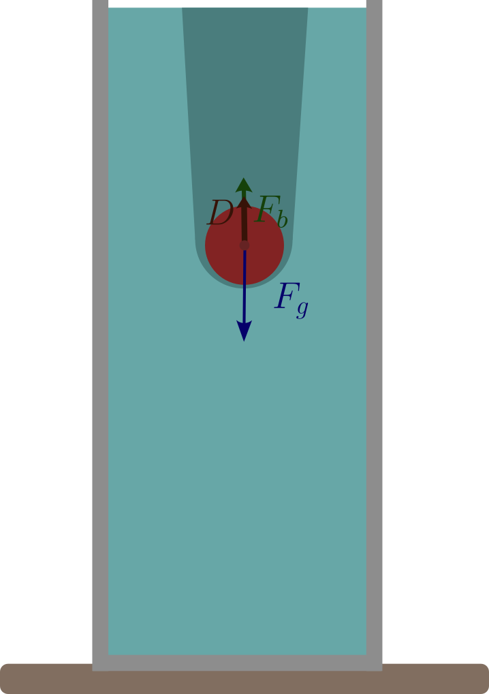
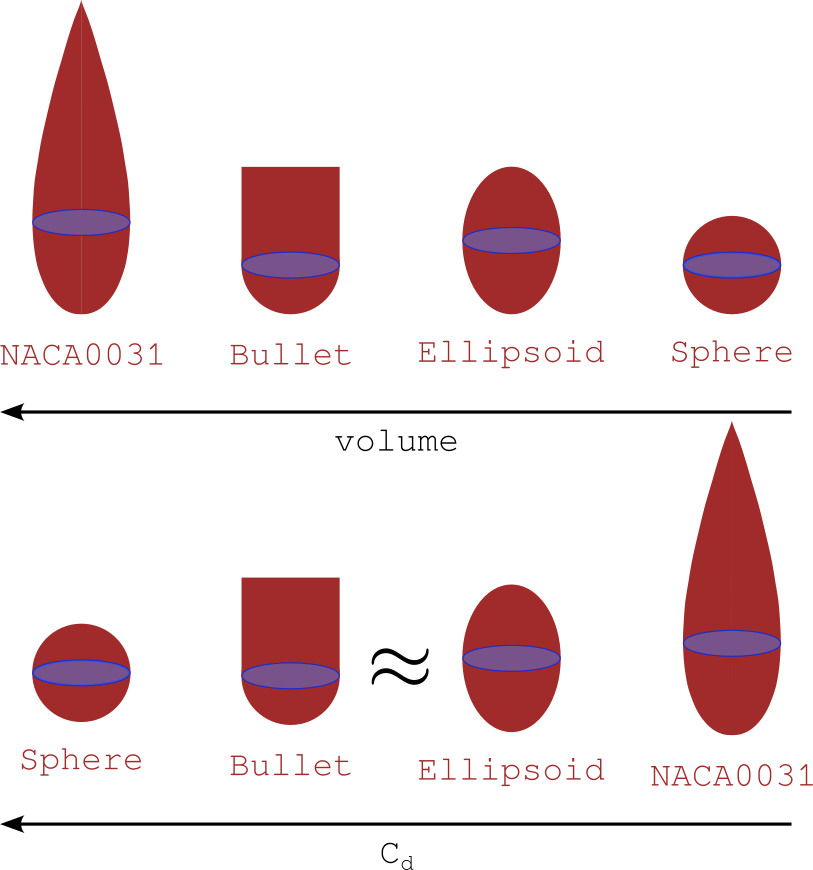
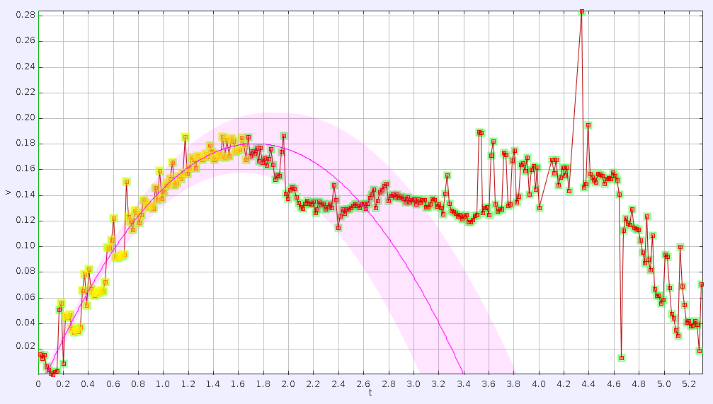
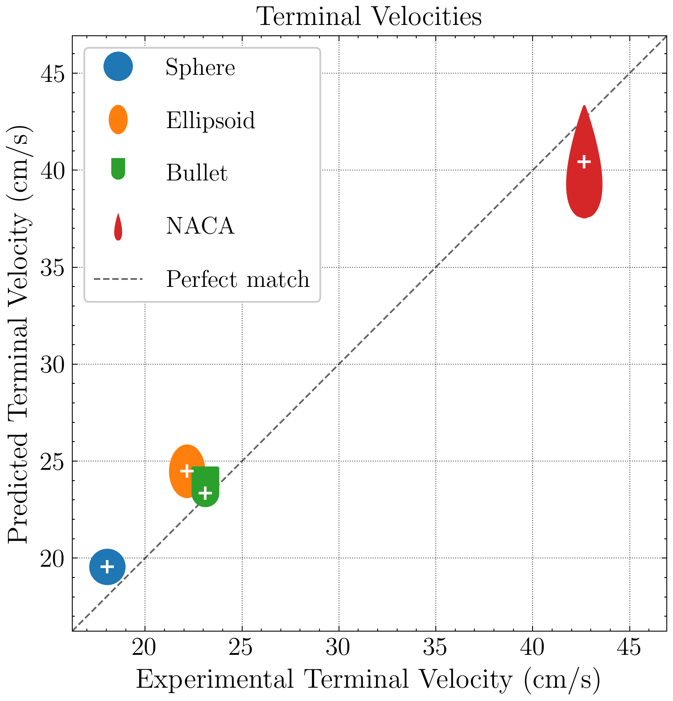

## Drop test: Setup

::: columns

::: {.column width="50%"}
{width=72.5%}
:::

::: {.column width="50%"}
{width=100%}
  
{width=100%}
:::

:::

## Drop test: Setup

::: columns

::: {.column width="50%"}
{width=72.5%}
:::

::: {.column width="50%"}
{width=100%}
:::

:::

## Drop test: Drop time

::: columns

::: {.column width="50%"}
{width=72.5%}
:::

::: {.column width="50%" .v-center}
a. What is the object's terminal velocity?
:::

:::

## Drop test: Terminal velocity

At terminal velocity:

$$mg - \rho_w Vg - F_D = 0$$

With quadratic drag:

$$F_D = \tfrac{1}{2}\rho_w C_D A v^2$$

$$\therefore \quad v_t = \sqrt{\dfrac{2(mg - \rho_w Vg)}{\rho_w C_D A}}$$

Define the mass excess:

$$\Delta m = m - \rho_w V$$

Substituting into $v_t$:

$$\boxed{v_t = \sqrt{\dfrac{2\Delta m\, g}{\rho_w C_D A}}}$$

## Drop test: Measuring $C_D$

Holding $\Delta m$, $g$, $\rho_w$, and $A$ constant:

$$v_t = \dfrac{K}{\sqrt{C_D}}, \qquad K = \sqrt{\dfrac{2\,\Delta m\, g}{\rho_w\, A}}$$

With $\Delta m = 1.8\ \text{g}$, $A = \pi(2.5)^2 \approx 19.6\ \text{cm}^2$, $g = 980.7\ \text{cm/s}^2$, $\rho_w = 1.0\ \text{g/cm}^3$:

$$\boxed{K = \sqrt{\dfrac{2 \times 1.8 \times 980.7}{1.0 \times 19.6}} \approx 13.4\ \text{cm/s}}$$

## Drop test: Fall time & $C_D$

At terminal velocity, the fall time over height $H$ is:

$$T = \frac{H}{v_t} = \frac{H\sqrt{C_D}}{K}$$

Solving for $C_D$ gives $C_D = \left(\dfrac{KT}{H}\right)^2$. With $H = 55.0\ \text{cm}$, $K \approx 13.4\ \text{cm/s}$:

$$\boxed{C_D = \left(\frac{K}{H}\right)^2 T^2 \approx 0.0594\, T^2}$$

## Drop test: Experiment

  

    Let's try it!
  

## Drop test: Experiment Results

$$
\begin{aligned}
T_{sphere} &= \qquad\quad &C_d = \qquad\qquad C_{d,theo} &= 0.47 \\\\
T_{ellipsoid} &= \qquad\quad &C_d = \qquad\qquad C_{d,theo} &= 0.30 \\\\
T_{bullet} &= \qquad\quad &C_d = \qquad\qquad C_{d,theo} &= 0.33\\\\
T_{NACA} &= \qquad\quad &C_d = \qquad\qquad C_{d,theo} &= 0.11
\end{aligned}
$$

## Drop test: Analysis

{width=100%}

## Drop test: Analysis

{width=100%}

## Drop test: Analysis

{width=100%}

## Drop test: Numerical Simulation

                   

  <video src="videos/Sphere.mp4" 
         data-autoplay  
         style="transform: rotate(-90deg); 
                height: 1000px; /* <-- INCREASED: Makes the video physically larger */
                width: auto;
                margin: 0;"></video>
  
  <video src="videos/Prolate.mp4"
         data-autoplay  
         style="transform: rotate(-90deg); 
                height: 1000px; /* <-- INCREASED: Makes the video physically larger */
                width: auto;
                margin: 0;"></video>
  
  

  
  

## Drop test: Numerical Simulation

                   

  <video src="videos/Sphere.mp4" autoplay loop muted 
         data-autoplay  
         style="transform: rotate(-90deg); 
                height: 1000px; /* <-- INCREASED: Makes the video physically larger */
                width: auto;
                margin: 0;"></video>
  
  <video src="videos/Bullet.mp4" autoplay loop muted
         data-autoplay   
         style="transform: rotate(-90deg); 
                height: 1000px; /* <-- INCREASED: Makes the video physically larger */
                width: auto;
                margin: 0;"></video>
  
  

  
  

## Drop test: Numerical Simulation

                   

  <video src="videos/Sphere.mp4" autoplay loop muted 
         data-autoplay  
         style="transform: rotate(-90deg); 
                height: 1000px; /* <-- INCREASED: Makes the video physically larger */
                width: auto;
                margin: 0;"></video>
  
  <video src="videos/Teardrop.mp4" autoplay loop muted
         data-autoplay   
         style="transform: rotate(-90deg); 
                height: 1000px; /* <-- INCREASED: Makes the video physically larger */
                width: auto;
                margin: 0;"></video>
  
  

  
  

## Thank you!

  

    For any question, feel free to reach me at  mcabral@tudelft.nl, or at my office, 34 B-2-320.
  

